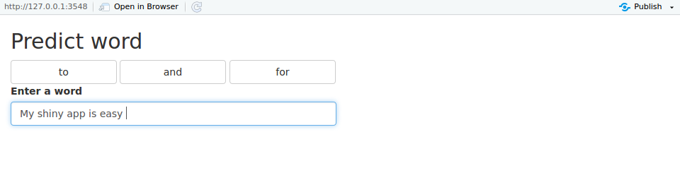

Capstone Pitch
========================================================
author: T. Henry
date: 11/07/2018
autosize: true

A text prediction application. The final step of the Johns Hopkins Coursera Data Science Specialization

<style>
.small-code pre code {
  font-size: 1em;
}
</style>

Executive summary
========================================================

After 9 courses learning Data sciences techniques, it's time to apply it!

Around the world, people are spending an increasing amount of time on their mobile devices for email, social networking, banking and a whole range of other activities. But typing on mobile devices can be a serious pain. SwiftKey, our corporate partner in this capstone, builds a smart keyboard that makes it easier for people to type on their mobile devices.

The goal of the capstone is to create a product similar to SwiftKey able to guess the next word that you will write.


Model
========================================================
class: small-code
After parsing the texts, the model is build using multiple tokenizer: bigram, trigram, ngram.


Example of what is contained in the model:

```
      frequency    type        V1         V2         V3       V4     V5
32435         1   ngram    orange      mayor     robert   bowser   will
31948         1   ngram       nos         im    process building       
14724         1 trigram       let       know    cobbler                
4829          1  bigram      like    persons                           
13525         1 trigram       got        car     report                
8124          1  bigram    staple       many                           
34673         1   ngram     right     behind     points     good enough
12499         1 trigram employees submitting fraudulent                
39189         1   ngram    waking    therave       last    night       
33303         1   ngram     point      bskyb       find  murdoch simply
```


Prediction
========================================================
class: small-code
The model is then used to predict the next word, knowing 1, 2, 3 or 4 previous words.
The 3 most frequent words will be selected and returned by the function.

To optimize the performances, tuples with a frequency of 1 are excluded from the model.

Example of the code used to predict the next word knowing only one word: 

```r
        predicted_words<- predict_model %>%filter(V1==words[length_phrase], V2!= "", type =="bigram") %>% top_n(3, frequency) %>% pull(V2) 
        predicted_words <- as.vector(predicted_words)[1:3]
```

Application
========================================================
The application is designed to predict the next word entered in the text input.
The 3 proposed words are displayed in the buttons at the top


If you click on one proposed word, it will be added in the text input

Regarding the performances, the application and the model will load in less than 10 seconds. Then the prediction of the next word is processed instantly.

Reference
========================================================
[Milestone report](http://rpubs.com/tristanry/399667)

[Shiny app](https://tristanry.shinyapps.io/predictWord2/)

[Shiny app source](https://github.com/tristanry/datasciencecoursera/tree/gh-pages/Capstone/predictWord)


